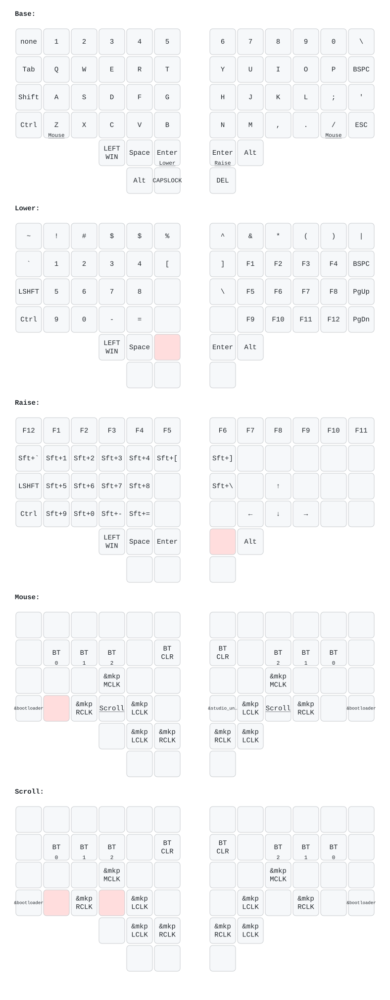

# Charybdis ZMK 固件配置

  &nbsp;&nbsp;&nbsp;&nbsp; 

本库为 **“喵喵喵猫”无线 Charybdis** 分体轨迹球键盘提供 ZMK 固件配置。原生支持通过 ZMK Studio 实时修改键位，针对无线连接与功耗表现进行了优化，并完全兼容官方的焊接版本。

---

## 🗺️ 键位布局

*本布局图由 GitHub Actions 自动生成。每次修改 `.keymap` 文件并提交后，图表都会自动同步更新。*

---

## 🛠️ 图形化配置

### 1. ZMK Studio（便捷实时改键）
借助官方 ZMK Studio 功能，无需重新刷机即可随时修改键位，所有更改即刻生效。
- **使用方法**：使用基于 Chromium 内核的浏览器（如 Chrome 或 Edge）打开并连接至 [ZMK Studio](https://zmk.studio/)，或直接使用独立的桌面客户端。
- **核心优势**：**即时生效**。通过 USB (WebHID) 或 Web 蓝牙直接与硬件进行通信。完全省去了等待 GitHub Actions 编译和手动刷写固件的繁琐步骤，非常适合日常快速调整基础键位。

### 2. Keymap Editor（在线完整编译）
社区目前最成熟的网页端可视化编辑器，与 GitHub 工作流深度集成，是进行键盘布局架构全面深度定制的理想选择。
- **使用方法**：[Fork](https://docs.github.com/en/get-started/quickstart/fork-a-repo#forking-a-repository) 本仓库，并在[GitHub Actions](https://docs.github.com/en/actions/managing-workflow-runs-and-deployments/managing-workflow-runs/disabling-and-enabling-a-workflow#enabling-a-workflow) 页面运行首次固件编译。随后，登录 [Keymap Editor](https://nickcoutsos.github.io/keymap-editor/)，完成授权并选择你名下的 `zmk-for-charybdis` 仓库。
- **核心优势**：**全功能编辑**。提供直观的图形化界面，支持拖拽改键，且全面支持组合键 (Combos)、宏 (Macros) 以及各类高级 ZMK 行为 (Behaviors)。保存更改后会自动将代码提交至 GitHub 并触发云端编译。

---

## 🚀 固件刷写指南

> **📌 刷写须知：**
> - **需要刷写**：仅当使用 **Keymap Editor** 修改布局、直接编辑 **仓库源码**，或对新键盘进行 **首次初始化配置** 时，才需要执行以下的刷写流程。
> - **无需刷写**：如果您仅通过 **ZMK Studio** 进行实时键位调整，所有更改将直接保存在硬件的板载闪存中，您可以完全跳过本指南。

### 标准刷写流程：

1. **编译固件**：在 Keymap Editor 中保存更改或直接推送代码提交，均会自动触发 GitHub Actions 编译。请前往您仓库的 **Actions** 标签页查看最新编译状态。
2. **下载固件**：编译成功后，在详情页底部的 **Artifacts** 区域下载 `firmware.zip` 压缩包。
3. **解压文件**：解压下载的压缩包，获取分别对应左右半边的 `left.uf2` 和 `right.uf2` 固件文件。
4. **进入 Bootloader (刷机模式)**：通过 USB 数据线将单边键盘连接至电脑。双击主控上的复位 (Reset) 按钮进入刷机模式，此时电脑上会出现一个虚拟 U 盘。
5. **拖拽刷写**：将对应的 `.uf2` 固件文件拖入该虚拟 U 盘中。主控会自动完成刷写、重启，并自动断开该 U 盘的连接。

> **⚠️ 注意：** 键盘左右手的主控是独立运行的，您必须分别通过 USB 连接两半键盘，并逐一进行单独刷写。

---

## 📝 致谢与支持

* **文档说明**：本文档初稿由 AI 辅助生成，并由作者进行了仔细校对与润色以确保技术准确性。如有由于AI处理导致的遣词造句上的生硬，敬请谅解。
* **技术支持**：如果您正在使用的是由 **“喵喵”** 制作的 Charybdis 分体键盘，在固件使用、图形化配置或刷机过程中遇到任何问题，欢迎通过以下渠道联系作者：
    * **📩 Gmail**: `heetuic@gmail.com`
    * **🐟 闲鱼**: 搜索 **“喵喵喵猫”**

---
